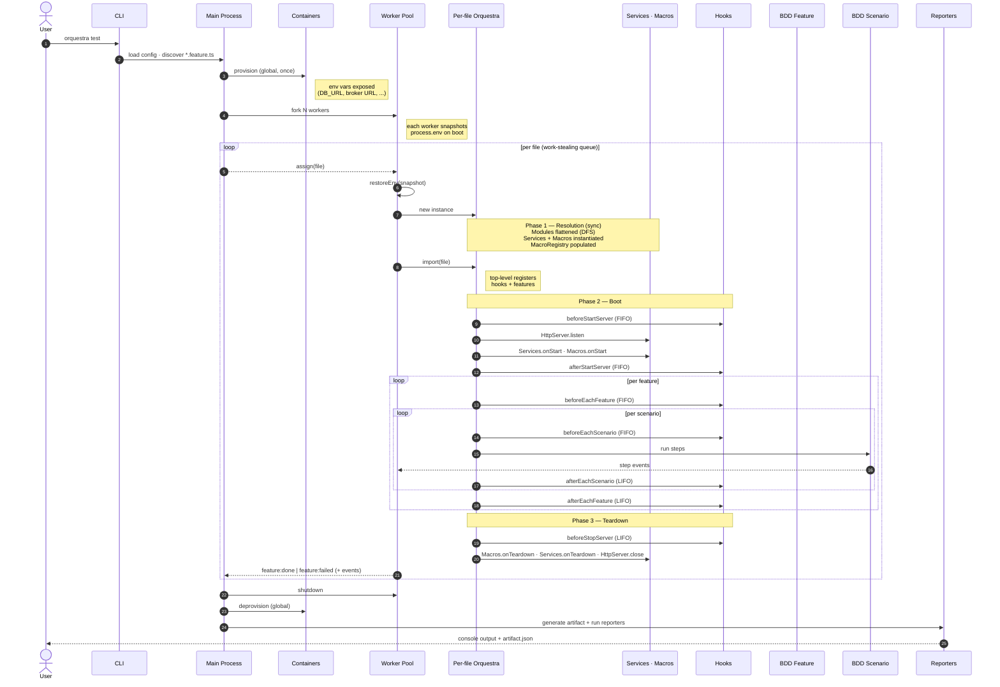

```mermaid
sequenceDiagram
    autonumber
    actor User
    participant CLI
    participant Main as Main Process
    participant Containers
    participant Workers as Worker Pool
    participant FileOrq as Per-file Orquestra
    participant Components as Services · Macros
    participant Hooks
    participant Feature as BDD Feature
    participant Scenario as BDD Scenario
    participant Reporters

    User->>CLI: orquestra test
    CLI->>Main: load config · discover *.feature.ts

    Main->>Containers: provision (global, once)
    Note right of Containers: env vars exposed<br/>(DB_URL, broker URL, ...)

    Main->>Workers: fork N workers
    Note right of Workers: each worker snapshots<br/>process.env on boot

    loop per file (work-stealing queue)
        Main-->>Workers: assign(file)
        Workers->>Workers: restoreEnv(snapshot)
        Workers->>FileOrq: new instance

        Note over FileOrq,Components: Phase 1 — Resolution (sync)<br/>Modules flattened (DFS)<br/>Services + Macros instantiated<br/>MacroRegistry populated

        Workers->>FileOrq: import(file)
        Note right of FileOrq: top-level registers<br/>hooks + features

        Note over FileOrq,Hooks: Phase 2 — Boot
        FileOrq->>Hooks: beforeStartServer (FIFO)
        FileOrq->>Components: HttpServer.listen
        FileOrq->>Components: Services.onStart · Macros.onStart
        FileOrq->>Hooks: afterStartServer (FIFO)

        loop per feature
            FileOrq->>Hooks: beforeEachFeature (FIFO)

            loop per scenario
                FileOrq->>Hooks: beforeEachScenario (FIFO)
                FileOrq->>Scenario: run steps
                Scenario-->>Workers: step events
                FileOrq->>Hooks: afterEachScenario (LIFO)
            end

            FileOrq->>Hooks: afterEachFeature (LIFO)
        end

        Note over FileOrq,Hooks: Phase 3 — Teardown
        FileOrq->>Hooks: beforeStopServer (LIFO)
        FileOrq->>Components: Macros.onTeardown · Services.onTeardown · HttpServer.close
        Workers-->>Main: feature:done | feature:failed (+ events)
    end

    Main->>Workers: shutdown
    Main->>Containers: deprovision (global)

    Main->>Reporters: generate artifact + run reporters
    Reporters-->>User: console output + artifact.json
```
